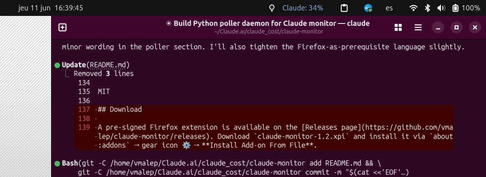

# Claude Monitor

A GNOME top bar indicator that shows your **Claude.ai usage** (session %, weekly %) and **Claude Code session cost** in real time on Ubuntu/GNOME.



## What it shows

Clicking the indicator opens a dropdown with:

| Field | Source |
|---|---|
| Session % used + reset time | claude.ai (via Firefox extension) |
| Weekly % used + reset time | claude.ai (via Firefox extension) |
| Claude Code session cost ($) | Claude Code hook |
| Input / output tokens | Claude Code hook |
| Last updated time | automatic |

The top bar label shows the **session % in colour** (blue → yellow → red as you approach the limit), or the Claude Code cost if no web data is available.

## Components

```
claude-monitor/
├── gnome-extension/        GNOME Shell extension (top bar indicator)
├── firefox-extension/      Firefox extension (reads claude.ai usage from DOM)
├── native-host/
│   ├── claude_monitor_host.py   Firefox → filesystem bridge
│   └── write_cost.py            Claude Code Stop hook
├── install.sh
└── uninstall.sh
```

## Requirements

- Ubuntu with GNOME Shell 45–50
- Firefox
- Python 3
- Claude Code (optional — only needed for cost tracking)

## Installation

```bash
git clone https://github.com/YOUR_USERNAME/claude-monitor
cd claude-monitor
chmod +x install.sh
./install.sh
```

Then **log out and back in** (required for GNOME to load the new extension).

After logging back in:

```bash
gnome-extensions enable claude-cost@local
```

### Load the Firefox extension

Firefox extensions that use native messaging must be loaded as a temporary add-on or signed. To load temporarily (sufficient for personal use):

1. Open Firefox → `about:debugging`
2. Click **This Firefox** → **Load Temporary Add-on**
3. Select `firefox-extension/manifest.json`

> **Note:** Temporary add-ons are removed when Firefox restarts. For a permanent install, see [Firefox extension signing](https://extensionworkshop.com/documentation/publish/).

### Test it

Go to **claude.ai**, click your avatar or the usage indicator to open the **Plan usage limits** popup. Within 5 seconds the GNOME top bar should update.

To test Claude Code tracking manually:

```bash
echo '{"cost_usd": 0.005, "input_tokens": 1000, "output_tokens": 200}' \
  | python3 ~/.claude/hooks/write_cost.py
cat ~/.claude_cost
```

## Data format

All data is stored in `~/.claude_cost` as JSON:

```json
{
  "session_pct":   16,
  "session_reset": "in 50 min",
  "weekly_pct":    21,
  "weekly_reset":  "Sat 3:59 AM",
  "code_cost":     0.0123,
  "input_tokens":  5000,
  "output_tokens": 1200,
  "last_updated":  "2026-06-08T20:30:00+00:00"
}
```

## Troubleshooting

**Indicator shows "Claude: no data"**
→ `~/.claude_cost` doesn't exist yet. Open the usage popup on claude.ai.

**GNOME extension in ERROR state**
```bash
journalctl /usr/bin/gnome-shell --since "5 minutes ago" | grep -A5 claude-cost
```

**Native messaging not working**
```bash
cat ~/.mozilla/native-messaging-hosts/claude_monitor_host.json
# Check that "path" points to a real file
python3 ~/.local/share/claude-monitor/claude_monitor_host.py  # should hang waiting for stdin
```

**Claude Code hook not firing**
```bash
cat ~/.claude/settings.json  # verify the Stop hook is present
echo '{"cost_usd":0.01}' | python3 ~/.claude/hooks/write_cost.py
cat ~/.claude_cost
```

## Uninstall

```bash
./uninstall.sh
```

## License

MIT
